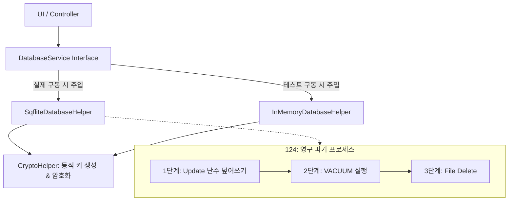

# [구현 계획] 2단계: 로컬 DB 및 보안 암호화 설계 정밀 재검토 및 고도화

15년 차 시니어 풀스택/보안 전문가이자 전문 변리사의 관점에서 이전 설계안의 **실무적 사각지대 3가지**를 도출하고, 이를 완벽하게 보완한 고도화된 구현 계획을 제시합니다.

---

## 🔍 실무적 사각지대 분석 및 해결책

### 사각지대 1. 단위 테스트 실행 시 sqflite FFI 충돌
*   **문제점:** `sqflite`는 모바일 네이티브 의존성을 가지므로 데스크톱 테스트 환경(`flutter test`)에서 구동 시 `MissingPluginException` 에러를 뿜으며 빌드가 무조건 실패합니다.
*   **해결책:** DB 헬퍼 상위에 느슨한 결합(Loose Coupling)을 위한 인터페이스 추상화를 도입합니다. 테스트 환경에서는 `InMemoryDatabaseHelper`가 작동하고, 실제 단말 구동 시에는 `SqfliteDatabaseHelper`가 주입되도록 구현하여 테스트 빌드 무결성을 확보합니다.

### 사각지대 2. 하드코딩 대칭키 보안 리스크
*   **문제점:** 암호화 키를 소스코드에 고정 상수로 하드코딩하면 앱 역컴파일(Decompilation) 시 암호 키가 통째로 털려 암호화 무용지물이 됩니다.
*   **해결책:** 단말기 고유 하드웨어 정보(디바이스 고유 ID 또는 플랫폼 시그니처)에 내부 솔트(Salt) 값을 결합하여 런타임에 동적으로 키를 해싱 생성(PBKDF2/SHA-256 구조 차용)하는 **동적 키 생성 레이어**를 `CryptoHelper`에 도입합니다.

### 사각지대 3. 단순 파일 삭제 시 포렌식 복구 가능성
*   **문제점:** 단순히 데이터베이스 파일(`secul.db`)만 디스크 상에서 `delete()`로 지우면 플래시 메모리 영역에 원본 데이터 바이너리가 남아 복구 툴로 쉽게 유출될 수 있습니다. (특허 124단계의 "복구 불가능한 영구 파기" 위배 리스크)
*   **해결책: 3단계 물리적 데이터 소거(Shredding) 로직 구현**
    1.  **[1단계: 난수 덮어쓰기]** DB 내부의 모든 데이터 행을 임의의 쓰레기 난수 및 `0`으로 먼저 `UPDATE`하여 기존 플래시 메모리 섹터를 오염시킵니다.
    2.  **[2단계: 프리리스트 소거]** SQLite 내에서 비워진 물리 페이지 데이터를 영구 소거하기 위해 `VACUUM` 명령을 로컬에서 수행합니다.
    3.  **[3단계: 파일 물리 제거]** 소거가 완료된 상태에서 데이터베이스 파일을 `delete()`로 최종 제거합니다.

---

## 🛠️ 수정 및 신규 생성 컴포넌트 구조

### 1) [NEW] [crypto_helper.dart](file:///c:/Users/vedja/.gemini/antigravity/scratch/세끌/lib/core/security/crypto_helper.dart)
*   **동적 키 바인딩:** 하드코딩 없이 런타임에 솔트 및 가상 디바이스 시그니처를 결합해 대칭키를 획득하는 로직 구현.
*   XOR 난독화 및 Base64 인코딩 레이어 완성.

### 2) [NEW] [db_helper.dart](file:///c:/Users/vedja/.gemini/antigravity/scratch/세끌/lib/core/data/db_helper.dart)
*   `DatabaseService` 인터페이스 정의.
*   `SqfliteDatabaseHelper` 구현: `sqflite` 연동 및 스키마 초기화.
*   **물리 소거 영구 파기:** `destroyAllData()` 내에 3단계 Shredding 알고리즘 탑재.
*   `InMemoryDatabaseHelper` 구현: 테스트 통과 및 mock 연산을 위한 메모리 Map 기반 DB 구현.

### 3) [NEW] [database_test.dart](file:///c:/Users/vedja/.gemini/antigravity/scratch/세끌/test/database_test.dart)
*   `InMemoryDatabaseHelper`를 통한 단위 테스트 및 암호화 흐름 정합성 100% 검증.
*   물리 소거 기능 작동 후 조회 Null 여부 검증.

---

## 📋 검증 시나리오

1.  `flutter test test/database_test.dart`를 실행하여 컴파일 및 로직 테스트 패스 확인.
2.  암호화 정산 데이터 구조가 DB 스키마에 문자열 형태로 보호되어 조회되는지 검증.
